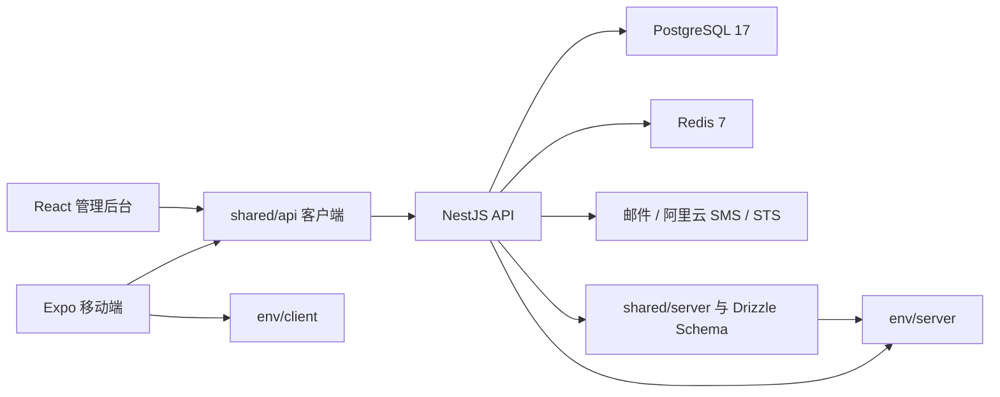

# Smart Lock 开发与交接指南

本文面向首次接手仓库的开发者，描述 2026-07-13 工作区中的实际结构、启动路径、验证结果和已知问题。它不是历史变更记录；命令与结论均以当前代码和本地验证为依据。

## 1. 项目边界

仓库是 pnpm workspace，由 Turborepo 编排五个工作区：

```text
smart_lock_memorepo/
├── apps/
│   ├── api/       NestJS 后端
│   ├── admin/     React Web 管理后台
│   └── client/    Expo/React Native 移动端
├── packages/
│   ├── env/       统一环境变量契约
│   └── shared/    数据库、API 客户端和共享类型
├── docker-compose.yml
├── package.json
├── pnpm-workspace.yaml
└── turbo.json
```

根目录脚本负责跨工作区编排，各工作区脚本负责自身构建和测试。应用之间不直接复制数据库类型或 API 基础设施，而是通过 `@smart-lock/shared` 和 `@smart-lock/env` 复用。

## 2. 总体架构



### 2.1 API 服务

入口是 `apps/api/src/main.ts`，根模块是 `apps/api/src/app.module.ts`。

- `main.ts` 创建 Nest 应用、接管日志、注册全局异常过滤器、CORS、Swagger，并监听 `PORT`。
- `AppModule` 装配认证、通知、好友、设备、临时密码、开锁记录和后台管理模块。
- `JwtAuthGuard` 以 `APP_GUARD` 注册为全局守卫；公开接口必须在守卫约定中显式放行。
- 业务模块通常按 Controller、Service、Repository 分层，数据库实例通过 `DatabaseModule` 注入。
- BullMQ、缓存和设备状态队列依赖 Redis。
- 邮件、短信和 STS 是外部依赖，本地仅填写占位值并不代表相关业务可用。

当前业务模块：

| 模块                 | 目录                                      | 职责                             |
| -------------------- | ----------------------------------------- | -------------------------------- |
| `auth`               | `apps/api/src/modules/auth`               | 普通用户认证                     |
| `admin`              | `apps/api/src/modules/admin`              | 管理员、RBAC、用户和设备后台接口 |
| `device`             | `apps/api/src/modules/device`             | 设备、设备型号、状态与队列       |
| `friend`             | `apps/api/src/modules/friend`             | 好友和授权关系                   |
| `notification`       | `apps/api/src/modules/notification`       | 通知、回调和异步队列             |
| `temporary-password` | `apps/api/src/modules/temporary-password` | 临时密码生命周期                 |
| `unLockRecord`       | `apps/api/src/modules/unLockRecord`       | 开锁记录                         |

### 2.2 管理后台

管理端入口为 `apps/admin/src/main.tsx`，路由位于 `apps/admin/src/routes`，`routeTree.gen.ts` 由 TanStack Router 插件生成，不应手工编辑。

受认证布局下目前有首页、管理员、用户、设备、设备型号和路由管理页面。数据访问通过 `apps/admin/src/lib/aip-service.ts` 创建的共享 `ApiClient` 完成，认证与可访问路由状态由 `AuthContext` 管理。

### 2.3 移动端

移动端使用 Expo Router，页面位于 `apps/client/app`。主要能力包括登录注册、设备管理、蓝牙配网、远程开锁、临时密码、开锁记录、通知和用户授权。

- `apps/client/contexts/api-context.tsx` 创建共享 API 客户端并接入 AsyncStorage、路由和 Toast。
- `apps/client/config/env.ts` 通过 `@smart-lock/env/client` 解析公开 URL。
- `apps/client/hooks/useDeviceSocket.ts` 等 Hook 负责实时状态订阅。
- 蓝牙和 Wi-Fi 原生能力要求开发构建或原生工程，不能只依赖 Expo Go 验证完整流程。

### 2.4 共享包

`@smart-lock/shared` 同时服务浏览器、React Native 和 Node.js，必须使用正确的子路径入口：

| 入口                            | 使用方          | 内容                                        |
| ------------------------------- | --------------- | ------------------------------------------- |
| `@smart-lock/shared` / `shared` | 全平台          | 类型、常量和通用工具                        |
| `@smart-lock/shared/api`        | 管理端、移动端  | API 客户端、查询 Hook、错误处理和平台适配器 |
| `@smart-lock/shared/client`     | 客户端          | 客户端专用导出                              |
| `@smart-lock/shared/server`     | API、数据库工具 | Drizzle 数据库、Schema 和服务端导出         |

数据库 Schema 位于 `packages/shared/src/db/schema`，Drizzle 配置位于 `packages/shared/drizzle.config.ts`。数据库连接只读取统一环境契约中的 `DATABASE_URL`。

### 2.5 环境配置包

`@smart-lock/env` 是环境变量的唯一事实来源：

- `src/definitions/server.ts`：服务端、数据库和第三方服务定义。
- `src/definitions/client.ts`：允许打包进 Expo 的公开变量。
- `src/runtime/server.ts`：从工作区根 `.env` 加载并校验服务端配置。
- `scripts/`：初始化、校验和生成 `.env.example`/README 环境表。

不要在业务代码中新增 `process.env.X` 后再单独更新文档。应先把变量加入定义文件，再通过生成命令同步派生文件。

## 3. 关键数据流

### 3.1 API 请求

1. 管理端或移动端通过 `@smart-lock/shared/api` 创建平台适配后的 `ApiClient`。
2. 适配器从 localStorage 或 AsyncStorage 读取令牌并发送 HTTP 请求。
3. NestJS 全局 JWT 守卫验证请求，Controller 进行 DTO/Zod 校验。
4. Service 执行业务规则，Repository 或共享数据库层访问 PostgreSQL。
5. 全局拦截器统一成功响应，异常过滤器将应用错误映射为 HTTP 响应。

### 3.2 设备状态与通知

设备和通知模块使用 Redis 作为 BullMQ 连接与缓存后端。后台任务由 Processor 消费，WebSocket/通知逻辑再把状态传给客户端。当前 Redis 地址在 API 根模块中固定为 `localhost:6379`，部署到非本机 Redis 前必须先处理该限制。

### 3.3 数据库变更

1. 修改 `packages/shared/src/db/schema`。
2. 执行 `pnpm db:generate` 生成迁移。
3. 审查生成的 SQL，不要直接假设自动迁移安全。
4. 执行 `pnpm db:migrate`。
5. 同步 Repository、共享类型、API DTO 和前端消费代码。

根 `.gitignore` 当前忽略 `drizzle/`，而 Drizzle 配置把迁移输出写到 `packages/shared/drizzle`。在依赖提交迁移文件前，应先确认团队希望采用“迁移文件入库”还是“运行时生成”的策略。

## 4. 本地启动

### 4.1 准备环境

```powershell
node --version
pnpm --version
docker version
docker compose version
pnpm install
pnpm --filter @smart-lock/env build
pnpm --filter @smart-lock/shared build
```

项目声明 Node.js `>=18` 和 pnpm `8.15.4`。当前验证使用 Node.js `22.18.0`、pnpm `8.15.4`。

仓库包含 `install.ps1` 和 `install.sh`，但它们会清理依赖和缓存、重复执行工作区安装并在最后运行全量 lint。接手时建议先使用上面的显式命令，只有理解脚本副作用后再运行安装脚本。

### 4.2 初始化环境变量

```powershell
pnpm env:init
```

该命令会：

1. 在根目录创建或补全 `.env`。
2. 为数据库密码、`DATABASE_URL`、`JWT_SECRET` 和 `DEBUG_KEY` 生成本地值。
3. 对仍为空的必填项输出 `[missing]` 并返回非零退出码。

邮件、阿里云和超级管理员配置需要人工填写。填写完毕后运行：

```powershell
pnpm env:check
```

不需要真实调用外部服务的本地开发可以使用明确的非生产占位值通过格式校验，但邮件、短信、STS 相关功能仍会失败，不能把“环境校验通过”等同于“第三方集成可用”。

### 4.3 启动 PostgreSQL 和 Redis

```powershell
docker compose up -d --wait
docker compose ps
```

Compose 使用 PostgreSQL 17 和 Redis 7，并创建 `postgres_data`、`redis_data` 两个命名卷。`.env` 中的 `DATABASE_USER`、`DATABASE_PASSWORD`、`DATABASE_NAME` 会传入 PostgreSQL 容器。

当前 Compose 把 5432、6379 发布到所有主机接口，Redis 也没有认证，只能用于本地或受信网络，不能原样部署到生产。需要降低本地暴露面时，将端口绑定改为 `127.0.0.1:5432:5432` 和 `127.0.0.1:6379:6379`，并配合主机防火墙。

停止但保留数据：

```powershell
docker compose down
```

删除容器和本地数据库/Redis 数据：

```powershell
docker compose down -v
```

`down -v` 不可恢复，不应作为常规故障排除的第一步。

### 4.4 初始化数据库

数据库工具也会加载完整服务端环境契约，因此必须先让 `pnpm env:check` 通过，并按 4.1 构建 `@smart-lock/env`。

```powershell
pnpm db:generate
pnpm db:migrate
pnpm db:studio
```

当前 `packages/shared/drizzle` 被根 `.gitignore` 忽略，干净克隆没有迁移文件。上面的 `db:generate` 仅是“全新克隆 + 空本地数据库卷”的临时初始化路径。对已有数据库或共享环境，先确认迁移历史和团队发布策略，不要生成新的基线后直接应用；也不要在不了解差异时使用 `pnpm db:generate:migrate`。

### 4.5 启动应用

```powershell
# 常用组合
pnpm dev:admin-api
pnpm dev:client-api
pnpm dev:all

# 单独启动
pnpm dev:api
pnpm dev:admin
pnpm dev:client
```

三个组合命令通过 Turbo 的 `dependsOn: ["^build"]` 自动构建依赖。三个单应用脚本只是直接执行 `pnpm --filter ... dev`，不会构建 `@smart-lock/env` 和 `@smart-lock/shared`；干净克隆必须先执行 4.1 中的两个共享包构建命令。

默认入口：

| 组件     | 地址/说明                        |
| -------- | -------------------------------- |
| API      | `http://localhost:3000`          |
| Socket   | `http://localhost:3001`          |
| Swagger  | `http://localhost:3000/api-docs` |
| 管理后台 | `http://localhost:8080`          |
| Expo     | 以 CLI 输出为准                  |

验证基础端口：

```powershell
Test-NetConnection localhost -Port 5432
Test-NetConnection localhost -Port 6379
Test-NetConnection localhost -Port 3000
Test-NetConnection localhost -Port 3001
Test-NetConnection localhost -Port 8080
```

### 4.6 真机连接

真机不能使用 `localhost` 访问开发机 API。保证手机和开发机处于同一局域网，然后在 `.env` 中设置：

```dotenv
EXPO_PUBLIC_API_URL=http://192.168.1.10:3000
EXPO_PUBLIC_SOCKET_URL=http://192.168.1.10:3001
```

这是当前代码的临时绕行配置：`main.ts` 的全局前缀排除规则实际排除了所有路由，所以普通用户 API 目前没有 `/api` 前缀；三个 WebSocket Gateway 则显式监听 3001。`@smart-lock/env` 中生成的 `/api` 和 3000 默认值与运行时不一致，修复路由与环境契约后应再次同步本节。修改 Expo 公开变量后需要重启 Metro，真机还要允许防火墙上的 3000、3001 端口。生产构建会拒绝仍指向 `localhost` 的客户端 URL。

## 5. 开发工作流

### 5.1 常用命令

```powershell
pnpm build
pnpm test
pnpm lint
pnpm format

pnpm --filter @smart-lock/api test
pnpm --filter @smart-lock/admin test
pnpm --filter @smart-lock/env test
pnpm --filter @smart-lock/shared test
```

根 `pnpm test` 会调用移动端默认开启 watch 的 `test` 脚本，因此当前不适合作为 CI 的一次性门禁。移动端一次性运行请使用：

```powershell
pnpm --filter @smart-lock/client exec jest --runInBand --watch=false
```

### 5.2 修改环境契约

```powershell
pnpm env:generate
pnpm env:check -- --contract
```

生成命令会修改 `.env.example` 和根 README 的标记区间。不要手工编辑标记区间，否则下一次生成会覆盖改动。

### 5.3 修改路由

- 管理端在 `apps/admin/src/routes` 新增或修改路由。
- Vite/TanStack Router 插件会重新生成 `routeTree.gen.ts`。
- 不要把生成文件中的格式变化当成业务修改；提交前检查差异是否只来自路由定义。
- 移动端路由由 `apps/client/app` 文件结构决定。

## 6. 当前已知问题

以下问题均由 2026-07-13 的代码检查或本地命令直接确认。它们是交接基线，不表示优先级已经由产品或团队确认。

| 严重度 | 问题                              | 证据与影响                                                                                         | 建议处理方向                                               |
| ------ | --------------------------------- | -------------------------------------------------------------------------------------------------- | ---------------------------------------------------------- |
| 高     | 当前 `.env` 阻断 API 与数据库工具 | `pnpm env:check` 因 12 个邮件、阿里云或超级管理员字段无效；Drizzle 配置也加载完整服务端契约        | 为本地/CI 定义可用配置策略，把真正可选的集成改为按功能启用 |
| 高     | 移动端 API 默认路径与运行时不一致 | `setGlobalPrefix('/api', { exclude: ['*', '*path'] })` 实际排除所有路由，但客户端默认基址含 `/api` | 修正 Nest 排除规则，并用集成测试锁定普通与后台路由前缀     |
| 高     | Socket 默认端口与 Gateway 不一致  | 环境契约默认 3000，三个 `@WebSocketGateway` 实际都监听 3001                                        | 统一环境默认值、客户端测试和部署端口                       |
| 高     | 干净克隆没有数据库迁移            | `packages/shared/drizzle` 有本地文件但被 `.gitignore` 排除，Git 中没有迁移                         | 明确迁移入库和发布策略；在此之前仅为空本地库生成临时基线   |
| 高     | 单应用脚本依赖本地旧产物          | `dev:api/admin/client` 不走 Turbo 依赖构建，`env/shared` 的 exports 又指向未入库的 `dist`          | 用 Turbo filter 启动，或在根脚本中显式构建依赖             |
| 高     | 全仓构建失败                      | `pnpm build` 在管理端 `tsc` 阶段报告 13 个 `TS6133` 错误                                           | 清理未使用代码，并把根构建加入持续集成                     |
| 高     | 全仓 lint 失败                    | `pnpm lint` 报告 250 个错误和 2436 个警告                                                          | 先按应用收敛规则与存量，再建立不回退的 CI 基线             |
| 高     | 共享包 lint 工具链崩溃            | 包级 ESLint 8 加载 TypeScript ESLint 规则时触发 `allowShortCircuit` TypeError                      | 统一 ESLint 与插件版本和配置入口                           |
| 高     | 管理端 API 地址硬编码             | `apps/admin/src/lib/aip-service.ts` 固定使用 `http://localhost:3000/admin`                         | 增加经校验的 Web 公开环境变量                              |
| 高     | Redis 地址硬编码                  | `AppModule` 中 BullMQ 和缓存均固定为 `localhost:6379`                                              | 把 Redis host、port、db 等加入 `@smart-lock/env`           |
| 高     | STS 验证未实现                    | `apps/api/src/common/sts/sts.service.ts` 的验证函数直接返回 `false`                                | 明确调用方和安全语义后实现验证与测试                       |
| 高     | 本地 Compose 暴露无认证 Redis     | 5432、6379 发布到所有主机接口，Redis 未配置认证                                                    | 限制为 loopback/受信网络；生产使用独立安全配置             |
| 中     | 管理端没有测试文件                | `pnpm --filter @smart-lock/admin test` 输出 `No test files found` 并退出 1                         | 先覆盖认证、RBAC 路由和 API 错误处理                       |
| 中     | 根测试不是可靠的一次性门禁        | 移动端 `test` 使用 `jest --watchAll`；API 的 `test:e2e` 引用不存在的配置                           | 增加各工作区 CI 脚本并补齐 API E2E 配置                    |
| 中     | 移动端脚本仅按 Windows 编写       | `apps/client/package.json` 使用 `set X=...` 和 `&&`                                                | 使用 `cross-env` 或 Node 启动脚本统一平台                  |
| 中     | 根构建不验证移动端                | 移动端 `build` 只输出占位信息                                                                      | 增加 Expo 类型检查/导出验证，原生构建进入平台 CI           |
| 中     | 管理端包体过大                    | Vite 主 chunk 为 1,210.68 kB，且 `autoCodeSplitting: false`                                        | 恢复路由拆包并检查重型依赖的导入方式                       |
| 中     | pnpm overrides 发出失效警告       | 当前 pnpm 提示根和客户端的 overrides 未生效                                                        | 核对实际 pnpm 配置来源并收敛到支持的位置                   |
| 低     | 安装脚本副作用过大                | 脚本删除依赖/缓存、重复安装工作区并强制运行 lint                                                   | 改为薄封装，默认只安装并提示后续检查                       |

## 7. 验证基线

2026-07-13 在 Windows PowerShell、Node.js `22.18.0`、pnpm `8.15.4` 下执行：

| 命令                                                                   | 结果                                                             |
| ---------------------------------------------------------------------- | ---------------------------------------------------------------- |
| `pnpm env:check`                                                       | 失败；12 个邮件、阿里云或超级管理员字段无效/为空                 |
| `pnpm --filter @smart-lock/env exec jest --runInBand`                  | 通过；7 个 Suite、14 个测试                                      |
| `pnpm --filter @smart-lock/shared exec jest --runInBand`               | 通过；2 个 Suite、7 个测试                                       |
| `pnpm --filter @smart-lock/api exec jest --runInBand`                  | 通过；2 个 Suite、3 个测试；存在 ts-jest 处理 env 构建产物的警告 |
| `pnpm --filter @smart-lock/client exec jest --runInBand --watch=false` | 通过；1 个 Suite、1 个测试                                       |
| `pnpm --filter @smart-lock/admin test`                                 | 失败；没有测试文件                                               |
| `pnpm build`                                                           | 失败；5 个任务中 4 个成功，管理端 TypeScript 检查失败            |
| `pnpm lint`                                                            | 失败；250 个错误、2436 个警告                                    |
| `pnpm --filter @smart-lock/shared lint`                                | 失败；ESLint 规则加载 TypeError，退出 2                          |

这里的通过仅代表命令覆盖到的范围。仓库没有完整 E2E 基线，且尚未验证真实门锁硬件、蓝牙配网、短信、邮件、STS 和生产部署。

## 8. 接手建议顺序

1. 修正 API 前缀和 Socket 端口契约，先让移动端能连接真实运行时。
2. 明确数据库迁移入库策略，并建立干净克隆的可重复初始化路径。
3. 让 `.env` 与本地依赖形成不要求真实第三方凭据的最小启动配置。
4. 修复管理端构建错误，并逐步收敛 lint 基线。
5. 把管理端 API URL 与 Redis 连接纳入环境契约。
6. 为管理端补最小测试，建立各工作区的一次性 CI 测试脚本。
7. 再处理 STS、邮件、短信和真实硬件链路；这些依赖外部凭据与设备，不能只靠单元测试宣称完成。

## 9. 文档维护规则

- 脚本名和命令以各级 `package.json` 为准。
- 环境变量以 `packages/env/src/definitions` 为准，并通过 `pnpm env:generate` 更新派生文档。
- API 模块以 `apps/api/src/app.module.ts` 的实际装配为准。
- 路由以 `apps/admin/src/routes` 和 `apps/client/app` 为准，不以旧截图或脚手架 README 为准。
- “已知问题”只写可定位到代码、测试或运行日志的事实；修复后在同一变更中删除或更新对应条目。
- 文档变更至少运行 Prettier、链接检查、环境契约检查和 `git diff --check`。
